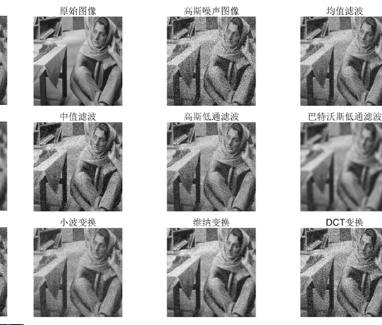
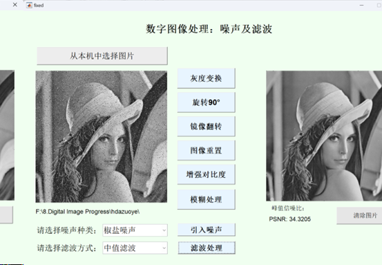

# 带噪图像滤波方法研究

## 目录

- [项目简介](#项目简介)  
- [特性](#特性)  
- [环境与依赖](#环境与依赖)  
- [快速开始](#快速开始)  
- [滤波方法](#滤波方法)  
- [结果可视化展示](#结果可视化展示)  
- [致谢](#致谢)  

---

## 项目简介

本项目旨在对三类典型噪声——高斯噪声、椒盐噪声与乘性噪声——进行建模，并采用多种经典与高级滤波算法对含噪图像进行去噪处理。同时设计了图形化界面（GUI），便于对比各算法的去噪效果，并通过峰值信噪比（PSNR）对去噪结果进行量化评估。

## 特性

- **噪声类型**：支持加性高斯噪声、椒盐噪声与乘性噪声三种常见噪声模拟。  
- **滤波算法**：实现了均值滤波、中值滤波、高斯低通滤波、巴特沃斯低通滤波、小波变换、维纳滤波和离散余弦变换（DCT）等多种去噪方法。  
- **性能指标**：内置 PSNR 计算模块，可定量比较不同方法在同一图像上的去噪效果。  
- **用户界面**：MATLAB GUI 界面，支持一键加载噪声图像、选择滤波算法、实时显示滤波前后对比和 PSNR 值。  

## 环境与依赖

- MATLAB R2018a 或以上  
- Image Processing Toolbox  
- Wavelet Toolbox（用于小波分解与重构）  
- （可选）Octave + 相应图像处理包  

## 快速开始
将codes在matlab解压，mlx文件即为模块运行结果，fig为GUI界面设计，打开即可立即使用！

项目中各滤波算法的实现文件位于 mlx文件：

add_noise.m：添加高斯噪声、椒盐噪声和乘性噪声

mean_filter.m：均值滤波

median_filter.m：中值滤波

gaussian_filter.m：高斯低通滤波

butterworth_filter.m：巴特沃斯低通滤波

wavelet_filter.m：小波变换

wiener_filter.m：维纳滤波

dct_denoise.m：DCT 变换去噪

## 结果可视化展示

- **以下为部分实验结果示例，完整结果请查看说明文档：**
以barbara图像为例，引入高斯噪声并观察所有情况的滤波情况：

完整的GUI界面设计：

---

##  联系作者

如有疑问或建议，欢迎访问我的 GitHub 主页 👇  ，通过邮箱与我联系。

🔗 [https://github.com/xy-lo](https://github.com/xy-lo)

如果这个项目对你有所帮助，欢迎点亮 ⭐Star！你的支持是我持续优化的动力！

If you find this project helpful, please consider giving it a ⭐ star — it would be greatly appreciated!

---

